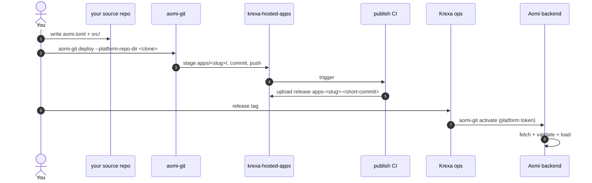

# Launching a Krexa Aomi App

End-to-end guide for shipping a Krexa Aomi app into krexa-hosted-apps and getting it loaded on the Aomi runtime. Invite-only — if you weren't given write access by Krexa ops, you're in the wrong place.

1. **Author** your app in your own source repo: a Rust `cdylib` crate + `aomi.toml` (`platform = "krexa"`).
2. **Deploy** with `aomi-git deploy` — stages your source into `apps/<slug>/` of a krexa-hosted-apps clone and pushes to `publish`.
3. **CI** builds the cdylib and publishes a GitHub release tagged `apps-<slug>-<short-commit>`.
4. **Activate**: hand the release tag to Krexa ops; they run `aomi-git activate` and the backend fetches + loads.



---

## Prerequisites

- **Rust nightly** (the SDK builds on `2024` edition)
- **`gh` (GitHub CLI)** logged into an account that has been added as a
  collaborator on `aomi-labs/krexa-hosted-apps`
- **`aomi-git`** — the deploy CLI, shipped from the SDK:

  ```bash
  cargo install --git https://github.com/aomi-labs/aomi-sdk --features cli aomi-sdk
  # binary lands at ~/.cargo/bin/aomi-git
  ```

You do NOT need the activation token to contribute. Krexa ops holds it.

---

## 1. Author your app in your own source repo

```
my-krexa-app/
├── aomi.toml
├── Cargo.toml
├── .gitignore       (must include .aomi/ and target/)
└── src/lib.rs       (dyn_aomi_app! registers your tools)
```

### `aomi.toml`

```toml
[app]
name         = "my-krexa-app"           # slug — kebab-case, becomes the release tag
display_name = "My Krexa App"
platform     = "krexa"                  # MUST be "krexa" for this repo
git          = "https://github.com/aomi-labs/krexa-hosted-apps"
public       = false                    # krexa apps are private by default on the backend

# Optional: pin which backend class can load this release.
# Omit to default to ["staging"]. Set to ["prod"] only after staging is verified.
# server_tags = ["staging"]
```

**`access_token` is currently not needed.** The krexa-hosted-apps repo is
public on GitHub today, so the backend can fetch release tarballs without
auth. If/when this repo is made private, add an env-var-referenced token
to your aomi.toml:

```toml
# only needed if/when this repo goes private — currently public, skip
access_token = "$KREXA_GH_READ_TOKEN"   # ✅ env-var ref
access_token = "ghp_xxxxxxx"            # ❌ rejected at parse — never commit secrets
```

Literal tokens (no `$` prefix) are rejected at parse so committed configs
cannot leak secrets.

### `Cargo.toml`

Pin the SDK to the version this repo's CI expects. Check `platform.json`
in this repo for the current `required_sdk_version`:

```toml
[package]
name = "my-krexa-app"
version = "0.1.0"
edition = "2024"

[lib]
crate-type = ["cdylib"]

[dependencies]
aomi-sdk   = "=0.1.20"          # match platform.json's required_sdk_version
serde      = { version = "1", features = ["derive"] }
serde_json = "1"
```

If your app needs HMAC/signing helpers, copy the small functions inline rather
than depending on `aomi-ext` — it's not on crates.io yet and a path dep from
this repo won't resolve. See `apps/my-krexa-bot/` for a reference layout.

---

## 2. Sanity check: dry-run preflight

```bash
cargo check                    # make sure it compiles
```

Then dry-run against staging:

```bash
export KREXA_GH_READ_TOKEN=ghp_...   # PAT with read access to releases
AOMI_BACKEND_URL=https://staging-api.aomi.dev \
  aomi-git deploy --dry-run --preflight
```

Open `.aomi/deployment.json` next to your `aomi.toml` and verify every check
passes:

```jsonc
{
  "checks": [
    { "name": "git_clean",                "passed": true },
    { "name": "platform_declared",        "passed": true, "detail": "krexa" },
    { "name": "git_declared",             "passed": true },
    { "name": "server_tags",              "passed": true, "detail": "defaulted to [staging] ..." },
    { "name": "backend_reachable",        "passed": true },
    { "name": "platform_resolved",        "passed": true, "detail": "krexa -> aomi-labs/krexa-hosted-apps" },
    { "name": "branch_matches_contract",  "passed": true, "detail": "publish == publish" },
    { "name": "git_url_matches_platform", "passed": true },
    { "name": "server_tags_match",        "passed": true, "detail": "target [staging] subset of server [staging]" }
  ]
}
```

If any check fails, fix `aomi.toml` before running deploy.

---

## 3. Deploy: stage + push

This is the step where `krexa-hosted-apps` enters the picture. Up to here
you've been working entirely in your own source repo. Now `aomi-git` needs
a **transit clone** of krexa-hosted-apps to stage your files into before
pushing.

### Two clones, one writes code, one transits

| Directory | Who edits | What for |
|---|---|---|
| Your source repo | **You.** Write Rust, commit. | Authoring. |
| A local clone of `krexa-hosted-apps` | **`aomi-git` only.** Never hand-edit. | Transit — the CLI copies your source in, commits, pushes. |

```bash
# anywhere on disk:
git clone https://github.com/aomi-labs/krexa-hosted-apps
```

Then, from **your source repo**, point the CLI at that clone:

```bash
aomi-git deploy --platform-repo-dir /path/to/krexa-hosted-apps
```

This:

1. Snapshots your source tree into `apps/<slug>/` in this repo
2. Writes the staging manifest CI expects
3. Commits and pushes to `publish`
4. The `publish-apps` workflow auto-fires:
   - validates the staged source against the manifest
   - runs `cargo build --release` for the cdylib
   - uploads a release tarball under `apps-<slug>-<short-source-commit>`

Watch CI at <https://github.com/aomi-labs/krexa-hosted-apps/actions>.

> Auto-activate will 502 if you set `AOMI_APP_ACTIVATION_TOKEN`, because the
> release tarball doesn't exist yet when push completes. That's expected. The
> platform operator runs the activate step once CI has uploaded.

---

## 4. Activation handoff

Once your CI run is green and the GitHub release exists, ping Krexa platform
ops with:

- the release tag (`apps-<slug>-<short-commit>`)
- the target environment (staging or prod)

They run:

```bash
aomi-git activate apps-<slug>-<short-commit> \
  --backend-url https://staging-api.aomi.dev \
  --activation-token <krexa-platform-token> \
  --source-repo aomi-labs/krexa-hosted-apps \
  --target-tag staging \
  --visibility private
```

…and confirms your app appears in
`https://staging-api.aomi.dev/api/control/apps/status`.

> **GitHub fetch auth.** Today this repo is public on GitHub, so the
> backend fetches the release tarball unauthenticated. If/when the repo
> goes private, ops would also need a one-shot GitHub PAT with read
> access (per ADR 0009 amended: passed in the activation request body,
> used once, never persisted, never logged) — passed via
> `--access-token-env <ENV_NAME>`.

### Why activation is held by ops, not contributors

- The activation token is the platform's commercial trust gate. Anyone holding
  it can mint or replace any Krexa app on the backend.
- Per ADR 0009 amended, the GitHub fetch token is **transient** — passed in
  each activation request, never persisted in the database, never logged. Krexa
  ops will ask you for a fresh PAT each activation; do not hand them a long-lived
  shared secret.

---

## 5. Promoting staging → prod

After your app is verified on staging:

1. Edit `aomi.toml` → `server_tags = ["prod"]`
2. Re-run `aomi-git deploy --platform-repo-dir <krexa-hosted-apps>` — this
   creates a new release tag (different source commit) targeting prod
3. Ask Krexa ops to activate against `https://api.aomi.dev` with
   `--target-tag prod`

Your app will not load on prod backends until step 3 — even though the row
exists in the shared backend database, the subset check `target_tags ⊆
AOMI_SERVER_TAGS` is enforced at activate time.

---

## Common errors

| Error | Cause | Fix |
|---|---|---|
| `git tree is dirty` | uncommitted files in your source repo (often `.aomi/deployment.json` from a previous dry-run) | commit, or add `.aomi/` to `.gitignore` |
| `aomi.toml [app].access_token must be \`$ENV_VAR_NAME\`` | you put a literal token in `aomi.toml` | use `"$ENV_VAR_NAME"`; never commit secrets |
| `env var \`KREXA_GH_READ_TOKEN\` is not set` | aomi.toml references a token env var that isn't exported | `export KREXA_GH_READ_TOKEN=ghp_...` before running |
| `dirty files outside owned publish path` | your krexa-hosted-apps clone has uncommitted changes to files NOT under `apps/<slug>/` | `git stash` in the clone |
| `activation endpoint returned 409 Conflict` | `target_tags` don't subset the backend's `AOMI_SERVER_TAGS` | match your env to the backend you're activating against |
| `activation endpoint returned 502 Bad Gateway` | release tarball doesn't exist yet (CI race) | retry after CI finishes |
| `sdk_version mismatch` | your `aomi-sdk` Cargo dep doesn't match `platform.json`'s `required_sdk_version` | pin to the right version |

## Quick reference

| Where | What |
|---|---|
| `https://staging-api.aomi.dev` | staging backend — first stop for any new app |
| `https://api.aomi.dev` | production backend — after staging is green |
| `/api/control/platforms` | recognized platforms (should include `krexa`) |
| `/api/control/server-tags` | what the backend matches (`[staging]` or `[prod]`) |
| `/api/control/apps/status` | full registry — your app should show `loaded: true` after activation |
| `platform.json` | CI contract: `required_sdk_version`, target, etc. |

For the underlying contract see ADR 0004, 0009 (amended), and 0010 in the
[aomi-launch-my-agent](https://github.com/aomi-labs/aomi-launch-my-agent)
repo.
