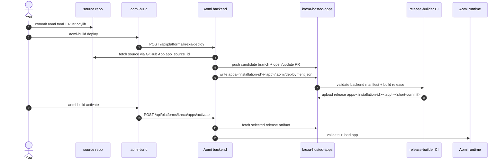

# Launching a Krexa Aomi App

End-to-end guide for shipping a Krexa Aomi app through `krexa-hosted-apps` and
getting it loaded on the Aomi runtime.

`krexa-hosted-apps` is a hosted partner release builder. The backend owns
deployment records, platform `.aomi/deployment.json`, build targeting, and
activation. This repo validates the backend-generated record and publishes
release artifacts.

1. **Author** your app in your own source repo: a Rust `cdylib` crate plus
   `aomi.toml` with `platform = "krexa"`.
2. **Connect** that source repo to Aomi: install the Aomi GitHub App and get
   the resulting `app_source_id` from Krexa ops or the portal.
3. **Deploy** with `aomi-build deploy`. The CLI sends a source-bound request to
   the backend.
4. **Backend staging** fetches your source through the GitHub App, writes
   `apps/<installation-id>/<app>/.aomi/deployment.json`, and opens or updates a
   platform PR in this repo.
5. **Release-builder CI** validates the backend manifest, builds the cdylib,
   and publishes release artifacts tagged
   `apps-<installation-id>-<app>-<short-source-commit>`.
6. **Activation** calls the backend. The backend resolves the requested PR,
   branch, commit, or release tags against its deployment record and fetches the
   desired artifacts.



---

## Prerequisites

- **Rust stable** matching this repo's workflow toolchain.
- **`git`** on `PATH`. `aomi-build` reads local git facts from your source repo.
- **`aomi-build`**, shipped by the Aomi SDK:

  ```bash
  cargo install --git https://github.com/aomi-labs/aomi-sdk --features cli aomi-sdk
  # binary lands at ~/.cargo/bin/aomi-build
  ```

- **Connected source repo**. Install the Aomi GitHub App on the repo containing
  your app and get the `app_source_id` for that install.
- **Backend credentials** from Krexa ops:
  - `AOMI_BACKEND_URL`, for example `https://staging-api.aomi.dev`
  - `AOMI_APP_SOURCE_ID`, or pass `--app-source-id`
  - `AOMI_APP_ACTIVATION_TOKEN`, or pass `--activation-token` to `activate`

You do not need direct write access to `aomi-labs/krexa-hosted-apps` for the
normal flow. The backend writes the platform PR through the Aomi GitHub App.

---

## 1. Author your app in your own source repo

```
my-krexa-app/
|-- aomi.toml
|-- Cargo.toml
|-- .gitignore       (include .aomi/, target/, and Cargo.lock)
`-- src/
    `-- lib.rs       (dyn_aomi_app! registers your tools)
```

### `aomi.toml`

```toml
[app]
name         = "my-krexa-app"
display_name = "My Krexa App"
platform     = "krexa"
public       = false

# Optional: choose which backend class can load this app.
# Omit to default to ["staging"]. Add "prod" only after staging is verified.
# server_tags = ["staging"]
```

Do not set the old `git` or `access_token` fields. Current `aomi-build`
validates `aomi.toml` strictly and will reject unknown fields. Source access is
bound by `app_source_id`, not by fields in the app manifest.

### `Cargo.toml`

Pin the SDK to the version this repo's CI expects. Check
[`platform.json`](./platform.json) for the current `required_sdk_version`:

```toml
[package]
name = "my-krexa-app"
version = "0.1.0"
edition = "2024"

[lib]
crate-type = ["cdylib"]

[dependencies]
aomi-sdk   = "=3.0.0"          # match platform.json's required_sdk_version
serde      = { version = "1", features = ["derive"] }
serde_json = "1"
```

If your app needs HMAC/signing helpers, copy the small functions inline rather
than depending on `aomi-ext` unless that crate is available to your build.

---

## 2. Build locally

From your source repo:

```bash
cargo check
cargo test
cargo build --release
```

The platform CI does the final Linux release build. `aomi-build compile` is for
SDK-style workspaces with an `apps/` directory, so most standalone source repos
should use plain Cargo locally.

---

## 3. Request onboarding if needed

If you do not yet have an `app_source_id` or platform/app token, ask through the
CLI so ops receives the app, GitHub account, email, and source repo in one
place:

```bash
aomi-build request \
  --platform krexa \
  --email you@example.com \
  --git-account your-gh-handle
```

Preview the Discord payload without posting:

```bash
aomi-build request \
  --platform krexa \
  --email you@example.com \
  --git-account your-gh-handle \
  --dry-run
```

The request does not include an activation token. Krexa ops issues credentials
out of band after validating the source repo and app ownership.

---

## 4. Deploy

Run deploy from your source repo after committing the app source:

```bash
export AOMI_BACKEND_URL=https://staging-api.aomi.dev
export AOMI_APP_SOURCE_ID=<app_source_id from Krexa ops or portal>
export AOMI_APP_ACTIVATION_TOKEN=<token from Krexa ops>

aomi-build deploy \
  --platform krexa \
  --aomi-toml aomi.toml
```

Useful variants:

```bash
# Show the backend request. If backend credentials are present, the backend also
# resolves and validates the plan without opening a PR.
aomi-build deploy --platform krexa --aomi-toml aomi.toml --dry-run

# Deploy a branch instead of local HEAD.
aomi-build deploy --platform krexa --branch publish-ready --aomi-toml aomi.toml

# Deploy multiple app configs from one source repo.
aomi-build deploy \
  --platform krexa \
  --aomi-toml apps/foo/aomi.toml \
  --aomi-toml apps/bar/aomi.toml
```

`deploy` sends `POST /api/platforms/krexa/deploy` with:

```json
{
  "app_source_id": 123,
  "source_ref": { "kind": "commit", "value": "<sha>" },
  "aomi_toml_paths": ["aomi.toml"],
  "dry_run": false
}
```

The backend deploy handler does the platform work:

1. Resolves the selected source ref to an exact commit.
2. Fetches the source repo archive through the GitHub App.
3. Parses each requested `aomi.toml`.
4. Copies app source into `apps/<installation-id>/<app>/`.
5. Generates `apps/<installation-id>/<app>/.aomi/deployment.json` from the
   backend deploy record.
6. Pushes a candidate branch for review/build.
7. Opens or updates a platform PR against `publish`.

The generated platform `deployment.json` records the backend's view of the
release: app metadata, source repository, source commit, platform, staged app
path, release tag, build target, and file hashes. CI validates this file, but
the backend owns it.

`aomi-build` may also maintain local `.aomi/` state in your source repo so
`status` and `activate` can find the last backend target. That local file is
not the platform contract.

Watch the platform PR and CI from the `pr_url` in local state, or from:
<https://github.com/aomi-labs/krexa-hosted-apps/actions>

`deploy` does not activate. It opens or updates the platform PR and lets CI
build the release artifact. Activate only after the artifact exists.

---

## 5. Release-builder CI

This repo is responsible for building artifacts from backend-staged source. CI
uses `publish` as the baseline, validates changed app directories under
`apps/<installation-id>/<app>/`, and checks each backend-generated
`.aomi/deployment.json`.

For each valid app, CI:

1. Confirms the staged app path matches `apps/<installation-id>/<app>`.
2. Confirms the app record release tag matches
   `apps-<installation-id>-<app>-<short-source-commit>`.
3. Confirms source commit, repository, platform, target triple, file hashes,
   and file byte counts.
4. Builds the app as a Rust `cdylib`.
5. Uploads:
   - `aomi-plugins-<release-tag>-<target>.tar.gz`
   - `manifest.json`
   - `aomi-release.json`

This repo builds and publishes artifacts. It does not decide which artifacts
are activated.

---

## 6. Check status

From your source repo:

```bash
aomi-build status --backend https://staging-api.aomi.dev
```

`status` uses local deploy state plus backend runtime state. Before activation,
the app may show as not registered or not loaded; that is expected while the
platform PR is still building or before activation runs.

Use JSON when wiring this into automation:

```bash
aomi-build status --backend https://staging-api.aomi.dev --json
```

---

## 7. Activate

Activation is backend-owned. The activation endpoint is:

```
POST /api/platforms/:platform/apps/activate
```

`aomi-build activate` calls that endpoint. Depending on the request, the
backend can resolve one of these target types:

- `platform_pr`
- `platform_branch`
- `platform_commit`
- `release_tags`

For PR or branch activation, the backend verifies the platform target, checks
CI state, can fast-forward the live branch when required, and derives app paths
and release tags from the backend candidate branch:

```
apps/<installation-id>/<app>
apps-<installation-id>-<app>-<short-source-commit>
```

For commit or explicit release-tag activation, the release tags must be
provided or derivable from the backend activation target.

After the release tag is resolved, the backend fetches the selected GitHub
release artifact, validates it against the expected SDK version, target, and
hashes, then loads the app.

Run activation after the platform PR is ready and CI has produced the release
artifact:

```bash
export AOMI_BACKEND_URL=https://staging-api.aomi.dev
export AOMI_APP_ACTIVATION_TOKEN=<token from Krexa ops>

aomi-build activate --target-tag staging
```

Explicit target forms:

```bash
aomi-build activate \
  --pr https://github.com/aomi-labs/krexa-hosted-apps/pull/9 \
  --target-tag staging

aomi-build activate \
  --release-tag apps-123456-my-krexa-app-abc1234 \
  --platform krexa \
  --target-tag staging
```

Confirm with:

```bash
aomi-build status --backend https://staging-api.aomi.dev
```

---

## Target tags

`aomi.toml [app].server_tags` is the build's declared load scope. If omitted,
the backend defaults it to `["staging"]`.

At activate time ops can narrow but cannot widen:

- If `server_tags = ["staging"]`, activation to prod is rejected.
- If `server_tags = ["staging", "prod"]`, activate staging first, then prod
  after staging is verified.

Krexa ops cannot promote a staging-only build to prod on your behalf. The
source commit must declare the wider scope before deployment.

---

## Promoting staging to prod

After staging is verified:

1. Edit `aomi.toml` and set `server_tags = ["staging", "prod"]` or
   `server_tags = ["prod"]`.
2. Commit the change in your source repo.
3. Re-run `aomi-build deploy --platform krexa --aomi-toml aomi.toml`.
4. Wait for the new platform PR/CI release.
5. Activate against production:

```bash
export AOMI_BACKEND_URL=https://api.aomi.dev
export AOMI_APP_ACTIVATION_TOKEN=<prod-capable token from Krexa ops>

aomi-build activate --target-tag prod
```

---

## Common errors

| Error | Cause | Fix |
|---|---|---|
| `deploy needs --app-source-id` | No connected source id was provided | Install the Aomi GitHub App on your source repo and pass `--app-source-id`, or export `AOMI_APP_SOURCE_ID` |
| `deploy requires an activation token via AOMI_APP_ACTIVATION_TOKEN` | Deploy calls the backend without a platform/app token | Get the token from Krexa ops and export `AOMI_APP_ACTIVATION_TOKEN` |
| `unknown field \`git\`` or `unknown field \`access_token\`` | Your `aomi.toml` still uses old deployment fields | Remove those fields; source access is bound by `app_source_id` now |
| `candidate app dir must be apps/<installation-id>/<app>` | Staged path does not match the backend contract | Redeploy through the backend |
| `deployment manifest release_tag must be ...` | Manifest release tag does not match the backend target | Redeploy through the backend |
| `no tracked aomi.toml found` | The config file is untracked or in a path the CLI cannot discover | Commit `aomi.toml`, or pass `--aomi-toml <path>` |
| `no .aomi/deployment.json` | You ran `status` or `activate` before a successful deploy | Run `aomi-build deploy` first, from the same source repo |
| `pass only one activation target` | Multiple target flags were passed | Use exactly one of `--target`, `--pr`, `--branch`, `--commit`, or `--release-tag` |
| App is active but not loaded | Backend registered the app row but runtime load failed | Check SDK version, release artifact, and backend logs; rebuild against `platform.json`'s `required_sdk_version` |
| `sdk_version mismatch` | Your `aomi-sdk` dependency does not match `platform.json` | Pin `aomi-sdk` to the required version and redeploy |

## Quick reference

| Where | What |
|---|---|
| `https://staging-api.aomi.dev` | staging backend, first stop for any new app |
| `https://api.aomi.dev` | production backend, after staging is green |
| `POST /api/platforms/:platform/deploy` | backend-owned source fetch, staging, and manifest generation |
| `POST /api/platforms/:platform/apps/activate` | backend-owned artifact resolution and activation |
| `/api/control/apps/status` | runtime registry status; app should show `loaded: true` after activation |
| local `.aomi/deployment.json` | CLI deploy state in your source repo |
| platform `.aomi/deployment.json` | backend-generated release manifest in `apps/<installation-id>/<app>/` |
| `platform.json` | static release-builder config |

For command details, see
[`aomi-build`](https://github.com/aomi-labs/aomi-sdk/blob/main/docs/aomi-build.md).
