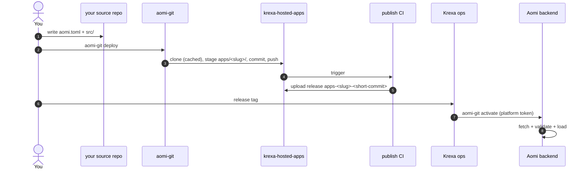

# Launching a Krexa Aomi App

End-to-end guide for shipping a Krexa Aomi app into krexa-hosted-apps and getting it loaded on the Aomi runtime. Invite-only — if you weren't given write access by Krexa ops, you're in the wrong place.

1. **Author** your app in your own source repo: a Rust `cdylib` crate + `aomi.toml` (`platform = "krexa"`).
2. **Deploy** with `aomi-git deploy` — stages your source into `apps/<slug>/` of a krexa-hosted-apps clone and pushes to `publish`.
3. **CI** builds the cdylib and publishes a GitHub release tagged `apps-<slug>-<short-commit>`.
4. **Activate**: hand the release tag to Krexa ops; they run `aomi-git activate` and the backend fetches + loads.



---

## Prerequisites

- **Rust nightly** (the SDK builds on `2024` edition)
- **`git`** on `PATH` — `aomi-git` shells out to it for the transit clone
- **`gh` (GitHub CLI)** logged into an account that has been added as a
  collaborator on `aomi-labs/krexa-hosted-apps`. Used implicitly: `git`'s
  credential helper picks up the `gh auth` token when cloning the platform
  repo.
- **`aomi-git`** — the deploy CLI, shipped from the SDK:

  ```bash
  cargo install --git https://github.com/aomi-labs/aomi-sdk --features cli aomi-sdk
  # binary lands at ~/.cargo/bin/aomi-git
  ```

You do NOT need the activation token to contribute. Krexa ops holds it.

---

## 1. Author your app in your own source repo

```
my-krexa-app/
├── aomi.toml
├── Cargo.toml
├── .gitignore       (must include .aomi/, target/, and Cargo.lock)
└── src/lib.rs       (dyn_aomi_app! registers your tools)
```

### `aomi.toml`

```toml
[app]
name         = "my-krexa-app"           # slug — kebab-case, becomes the release tag
display_name = "My Krexa App"
platform     = "krexa"                  # MUST be "krexa" for this repo
git          = "https://github.com/aomi-labs/krexa-hosted-apps"
public       = false                    # krexa apps are private by default on the backend

# Optional: pin which backend class can load this release.
# Omit to default to ["staging"]. Set to ["prod"] only after staging is verified.
# server_tags = ["staging"]
```

#### About `access_token`

`aomi-git` works by pushing your code into a managed platform repository under
the `aomi-labs` GitHub org — for Krexa, that's `aomi-labs/krexa-hosted-apps`
(this repo). At activation time, the Aomi backend **fetches your release
tarball from that platform repo on GitHub**. So whether you need an
`access_token` depends on one question: is the platform repo public or
private on GitHub?

- **Today, `krexa-hosted-apps` is public on GitHub.** The backend can fetch
  your release tarball anonymously. You can omit the `access_token` field
  from your `aomi.toml`.
- **If/when this repo is made private** — which is the eventual B2B intent —
  the backend will need a GitHub PAT with read access to releases. You'd
  declare it in `aomi.toml` as a reference to an env var, never the token
  itself. Literal tokens are rejected at parse so a committed config can
  never leak a secret:

  ```toml
  # add when krexa-hosted-apps goes private — currently public, skip
  access_token = "$KREXA_GH_READ_TOKEN"   # ✅ env-var ref — resolved at deploy time
  access_token = "ghp_xxxxxxx"            # ❌ rejected at parse — never commit secrets
  ```

Per [ADR 0009 amended](https://github.com/aomi-labs/aomi-launch-my-agent),
the fetch token is **transient**: passed once in the activation request body,
used once by the backend to download the tarball, never persisted, never
logged, never written to disk. When this repo does go private, Krexa ops
will ask you for a fresh PAT each activation rather than holding one
long-lived shared secret.

> Note: this `access_token` (a GitHub PAT) is a **separate concept** from the
> Krexa platform's **activation token**, which authorizes writes against the
> Aomi backend. The activation token is held by Krexa ops — you never see it.

### `Cargo.toml`

Pin the SDK to the version this repo's CI expects. Check `platform.json`
in this repo for the current `required_sdk_version`:

```toml
[package]
name = "my-krexa-app"
version = "0.1.0"
edition = "2024"

[lib]
crate-type = ["cdylib"]

[dependencies]
aomi-sdk   = "=0.1.20"          # match platform.json's required_sdk_version
serde      = { version = "1", features = ["derive"] }
serde_json = "1"
```

If your app needs HMAC/signing helpers, copy the small functions inline rather
than depending on `aomi-ext` — it's not on crates.io yet and a path dep from
this repo won't resolve. See `apps/my-krexa-bot/` for a reference layout.

---

## 2. Sanity check: build + dry-run

```bash
cargo check                    # make sure it compiles
```

Then dry-run against staging. Dry-run does the offline plan **and** the online
preflight (backend reachability, branch contract, server-tag subset check) —
it's the single "show me what would happen" command:

```bash
# only export KREXA_GH_READ_TOKEN if your aomi.toml declares
# access_token = "$KREXA_GH_READ_TOKEN" (currently optional — see above)
AOMI_BACKEND_URL=https://staging-api.aomi.dev \
  aomi-git deploy --dry-run
```

You should see all four pipeline stages pass:

```text
Preflight
  [ok]   workspace git_clean
  [ok]   manifest  platform_declared, git_declared  ·  defaulted=true server_tags=[staging]
  [ok]   platform  platform_resolved, branch_matches_contract, git_url_matches_platform  ·  deployment_branch=publish github_repo=aomi-labs/krexa-hosted-apps name=krexa
  [ok]   backend   backend_reachable, server_tags_match
```

The same plan also lands in `.aomi/deployment.json` next to your `aomi.toml`
(read it if you need machine-readable detail or want to inspect resolved
facts).

If any stage fails, fix the underlying issue (usually your `aomi.toml`)
before running deploy. Warnings (`[warn]`) are advisory and don't block —
a common one is `git_url_matches_platform` when you're deploying from a fork.

---

## 3. Deploy

From your source repo:

```bash
aomi-git deploy
```

That's it. `aomi-git` manages a transit clone of `krexa-hosted-apps` for you
under `~/.aomi/transit/aomi-labs-krexa-hosted-apps/` (you never touch it —
it's a CLI-managed cache). On first deploy it clones; on subsequent deploys
it fetches and resets. Auth flows through your normal `git` credential
helper — if you've been added as a collaborator and `gh auth login` works,
this works.

This:

1. Snapshots your source tree into `apps/<slug>/` in the transit clone
2. Writes the staging manifest CI expects
3. Commits and pushes to `publish`
4. The `publish-apps` workflow auto-fires:
   - validates the staged source against the manifest
   - runs `cargo build --release` for the cdylib
   - uploads a release tarball under `apps-<slug>-<short-source-commit>`

Watch CI at <https://github.com/aomi-labs/krexa-hosted-apps/actions>.

> Auto-activate will 502 if you set `AOMI_APP_ACTIVATION_TOKEN`, because the
> release tarball doesn't exist yet when push completes. That's expected. The
> platform operator runs the activate step once CI has uploaded.

### Escape hatch: `--platform-dir`

If you need to manage the clone yourself (air-gapped CI, custom auth, or
debugging the staged tree before push), pass a directory you control:

```bash
aomi-git deploy --platform-dir /path/to/your/krexa-hosted-apps-clone
```

This skips the transit cache entirely. You're responsible for keeping that
clone in sync with `origin/publish`. Most contributors should never need this.

---

## 4. Activation handoff

Once your CI run is green and the GitHub release exists, hand off to Krexa
platform ops.

### When is CI done?

`aomi-git deploy` prints a Next-steps block at the end that links the two
URLs you need to watch:

1. **CI build status** — `https://github.com/aomi-labs/krexa-hosted-apps/actions`.
   Wait for the run triggered by your push to go green (~1–3 min).
2. **Release availability** — once CI succeeds, your release appears at
   `https://github.com/aomi-labs/krexa-hosted-apps/releases/tag/apps-<slug>-<short-commit>`.
   This is the artifact the backend will fetch.

When both are green, you're ready to request activation.

### Requesting activation

Post in the `#aomi-apps` Discord channel and tag `@platform-ops`. Include:

- **Release tag:** `apps-<slug>-<short-commit>` (printed by `aomi-git deploy`,
  also in your `.aomi/deployment.json`)
- **Target environment:** `staging` for the first activation, `prod` later
  after staging is verified
- **Your GitHub handle** so we can confirm the activated app back to you

A `@platform-ops` member runs `aomi-git activate` against the target backend
with the Krexa platform token (held by them), then confirms by linking your
app at `https://staging-api.aomi.dev/api/control/apps/status`.

### What ops actually runs

If they have access to your source repo's `.aomi/deployment.json` (e.g. you
handed them the directory or they checked out your branch), the whole
command is a one-liner:

```bash
AOMI_APP_ACTIVATION_TOKEN=<krexa-platform-token> \
AOMI_BACKEND_URL=https://staging-api.aomi.dev \
  aomi-git activate
```

`aomi-git activate` reads `.aomi/deployment.json` (left there by your
`aomi-git deploy`) and pulls release tag, platform, source repo, source
provenance, display name, visibility, **and target tags** from it. The
target tags come from the build's `server_tags` (see "How target tags work"
below) — ops doesn't normally pass `--target-tag` at all.

The common Krexa B2B case is the opposite: ops works from a separate
machine and just receives a release tag from you. Then every field is
explicit:

```bash
aomi-git activate apps-<slug>-<short-commit> \
  --backend https://staging-api.aomi.dev \
  --activation-token <krexa-platform-token> \
  --platform krexa \
  --git aomi-labs/krexa-hosted-apps \
  --target-tag staging \
  --visibility private
```

…and confirms your app appears in
`https://staging-api.aomi.dev/api/control/apps/status`.

> **GitHub fetch auth.** Today `krexa-hosted-apps` is public on GitHub, so
> the backend fetches the release tarball unauthenticated. If/when the
> repo goes private, ops will also need a one-shot GitHub PAT with read
> access (per ADR 0009 amended: passed in the activation request body,
> used once, never persisted, never logged) — passed via `--access-token
> "$ENV_NAME"` (matching the same `$ENV_NAME` form used in `aomi.toml`).

### How target tags work

`aomi.toml [app].server_tags` is the **build's declared scope** — the set of
backend tiers you (the contributor) signed off on shipping to. `aomi-git
deploy` copies this into `.aomi/deployment.json`, where it travels with the
release.

At activate time ops can **narrow** but cannot **widen**:

- If you declared `server_tags = ["staging"]` in aomi.toml, ops can only
  activate to staging. An attempt to widen to prod is rejected with a
  multi-line error pointing back at your source repo.
- If you declared `server_tags = ["staging", "prod"]`, ops can activate to
  either (or both). They'll typically start with `--target-tag staging`,
  verify, then re-run with `--target-tag prod`.

This makes your word at build time a contract, not advisory. If you want
your app on prod, you have to say so in your aomi.toml first — Krexa ops
can't widen the scope on your behalf.

### Why activation is held by ops, not contributors

- The activation token is the platform's commercial trust gate. Anyone holding
  it can mint or replace any Krexa app on the backend.
- Per ADR 0009 amended, the GitHub fetch token is **transient** — passed in
  each activation request, never persisted in the database, never logged. Krexa
  ops will ask you for a fresh PAT each activation; do not hand them a long-lived
  shared secret.

---

## 5. Promoting staging → prod

After your app is verified on staging:

1. Edit `aomi.toml`: change `server_tags = ["staging"]` to either
   `["prod"]` (prod-only) or `["staging", "prod"]` (both tiers loadable
   from this release).
2. Re-run `aomi-git deploy` — this creates a new release tag (different
   source commit) carrying the wider declared scope.
3. Post in `#aomi-apps` Discord, tag `@platform-ops` / Krexa ops, and ask
   for activation against `https://api.aomi.dev`. Per the target-tag rule,
   ops cannot promote your existing staging release to prod without this
   re-deploy — the build's declared scope is the activation ceiling.

Your app will not load on prod backends until step 3 — even though the row
exists in the shared backend database, the subset check `target_tags ⊆
AOMI_SERVER_TAGS` is enforced at activate time.

---

## Common errors

| Error | Cause | Fix |
|---|---|---|
| `git tree is dirty` | uncommitted files in your source repo (often `.aomi/deployment.json` from a previous dry-run) | commit, or add `.aomi/`, `target/`, and `Cargo.lock` to `.gitignore` |
| `aomi.toml [app].access_token must be \`$ENV_VAR_NAME\`` | you put a literal token in `aomi.toml` | use `"$ENV_VAR_NAME"`; never commit secrets |
| `env var \`KREXA_GH_READ_TOKEN\` is not set` | aomi.toml references a token env var that isn't exported | `export KREXA_GH_READ_TOKEN=ghp_...` before running |
| `git clone ... exited 128` | `aomi-git` couldn't fetch the platform repo into its transit cache (auth or network) | `gh auth login`; confirm you're a collaborator on `aomi-labs/krexa-hosted-apps`; if still wedged, `rm -rf ~/.aomi/transit/aomi-labs-krexa-hosted-apps/` and retry |
| `failed to refresh transit clone` | transit cache got into a weird state (interrupted clone, manual edits) | `rm -rf ~/.aomi/transit/aomi-labs-krexa-hosted-apps/` and re-run `aomi-git deploy` |
| `activation endpoint returned 409 Conflict` | `target_tags` don't subset the backend's `AOMI_SERVER_TAGS` | match your env to the backend you're activating against |
| `activation endpoint returned 502 Bad Gateway` | release tarball doesn't exist yet (CI race) | retry after CI finishes |
| `sdk_version mismatch` | your `aomi-sdk` Cargo dep doesn't match `platform.json`'s `required_sdk_version` | pin to the right version |

## Quick reference

| Where | What |
|---|---|
| `https://staging-api.aomi.dev` | staging backend — first stop for any new app |
| `https://api.aomi.dev` | production backend — after staging is green |
| `/api/control/platforms` | recognized platforms (should include `krexa`) |
| `/api/control/server-tags` | what the backend matches (`[staging]` or `[prod]`) |
| `/api/control/apps/status` | full registry — your app should show `loaded: true` after activation |
| `platform.json` | CI contract: `required_sdk_version`, target, etc. |

For the underlying contract see ADR 0004, 0009 (amended), and 0010 in the
[aomi-launch-my-agent](https://github.com/aomi-labs/aomi-launch-my-agent)
repo.
