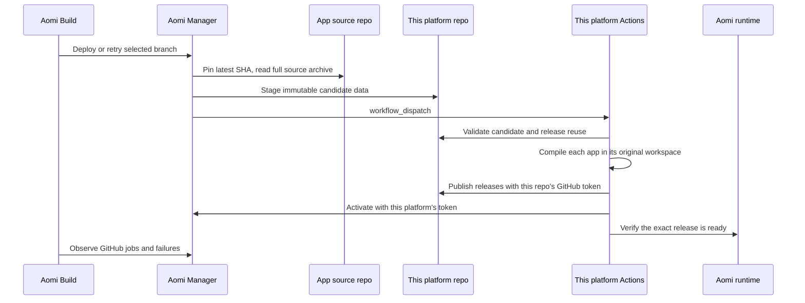

# Platform deployment workflow

This platform repository owns app compilation, release publication, deployment
runs and logs. Aomi maintains the default workflow/scripts here by PR; the
platform may customize its runners and build steps. The default runs on GitHub
`ubuntu-latest`. Product-mono CI does not compile these app deployments.

## Setup and customization

Keep `.github/workflows/deploy-project.yml` and both scripts in
`.github/scripts/` on the configured platform deployment branch. For these
platforms that branch and the GitHub default branch are `publish`.

Use the platform's existing Aomi token as the GitHub environment secret
`AOMI_PLATFORM_TOKEN` in `staging` and/or `production`, matching the intended
target. Only Activate and Verify use it. The built-in `github.token` publishes
releases with `contents: write`. No global admin or GitHub App private key is
needed here. Manager's GitHub App must be installed on this platform repository
with Contents, Pull Requests and Actions read/write access.

Adjust `runs-on`, caching or compilation for your platform. Preserve these
inputs and job names so Aomi Build can report progress and recovery correctly:

| Contract | Values |
| --- | --- |
| Workflow | `deploy-project.yml`, triggered explicitly by Manager |
| Inputs | `project_id`, `previous_run_id`, `source_ref`, `source_branch`, `candidate_ref`, `deployment_id`, `deployment_path`, `environment`, `activate` |
| Source/candidate refs | Exact immutable source/platform commit SHAs |
| Environment | `staging` or `production` |
| Run title | `aomi-deploy\|environment\|project_id\|source_sha\|source_branch\|previous_run_id` |
| Jobs | Validate; Build / app; Publish release; Activate; Verify runtime / app |
| Build target | `x86_64-unknown-linux-gnu` |

`activate=false` builds and publishes a candidate for explicit later activation.
There is no candidate-push build trigger and no workflow requirement in the
app source repository. Platform workflow tests run on PRs to `publish`.

## Source and release layout

Manager commits one complete source snapshot to
`.aomi/candidates/<deployment_id>/source.tar.gz` and app metadata to
`apps/<installation>/<repo-key>/<app>/aomi.toml` plus `.aomi/deployment.json`.
The original workspace directory layout and executable bits are preserved.
Workspace and standalone apps use the same packaging/build path. Source archive
visibility follows this repository, including its retained Git history.

Commit Cargo.lock at the workspace/package root. Builds use `cargo --locked`.
Missing locks fail validation and stale locks fail compilation. Source archives
reject links, path escapes, files over 10 MiB, over 10,000 entries, and more than
256 MiB expanded content. Cross-repository private dependency credentials are
not provisioned by this workflow.

Release tags are `apps-<installation>-<repo-key>-<app>-<short-source-sha>`.
Each release contains the bundle `aomi-plugins-<tag>-<target>.tar.gz`,
`manifest.json`, and `aomi-release.json`. Publication verifies the source and
candidate identities, SDK/target, bundle names and checksums.

Retry resolves the newest source SHA, preserves the previous GitHub attempt and
reuses complete releases at the same candidate commit. Existing tags are never
retargeted or overwritten. Incomplete/conflicting releases require repair or a
new source commit. Old unpublished candidates without snapshots are restaged by
Manager; old partially published candidates require a new source commit to build
remaining apps. Cancellation is checked before activation; it cannot undo an
activation already accepted by Aomi.

Only successful verification of each exact expected runtime artifact means Live.
Transient readiness reads reconnect four times (4/8/16/30 seconds); overall
readiness waits at most eight minutes. Code failures are not automatically
recompiled. Failures remain in GitHub with stage/step diagnostics surfaced in
Build. No deployment-attempt database or log store is introduced.

## Validation

Run `python3 -m unittest discover -s .github/scripts -p 'test_*.py' -v` and
Actionlint against both workflows. Tests use local Cargo fixtures and mocked
GitHub/activation calls; they do not publish releases or activate apps. A real
staging run after platform and Manager rollout remains required.
